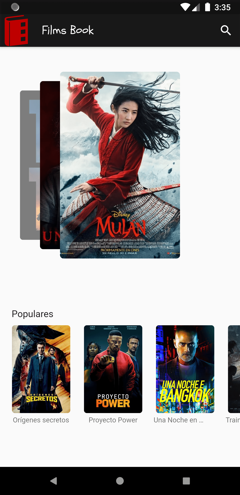
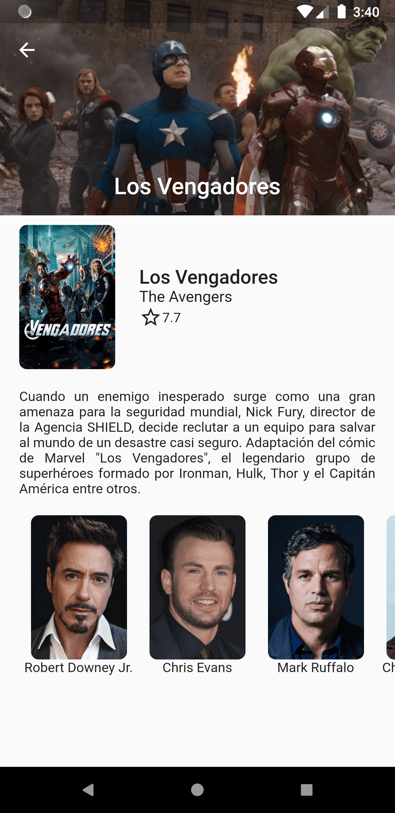

# FilmsBook App :movie_camera:

Proyecto Git Init - Comunidad Hackspace. 

Encuentra el resumen de tus peliculas favoritas y nuevos estrenos, y descubre si tus actores forman parte del elenco.

## Temas aprendidos

* Consumo de servicios REST
* PageViews
* Manejo de data con Streams
* Creación de Widgets personalizados
* Infinite Horizontal Scroll
* SearchDelegate

## Demo: 

  
  

  
  

## Guías y Referencias:

Curso Flutter Udemy:

- [Flutter: Tu guía completa de desarrollo para IOS y Android ](https://www.udemy.com/course/flutter-ios-android-fernando-herrera/)

Documentación Oficial: 

- [Flutter: Documentación Oficial](https://flutter.dev/)

## Herramientas de planificación y organización:

* Asana y Clockify